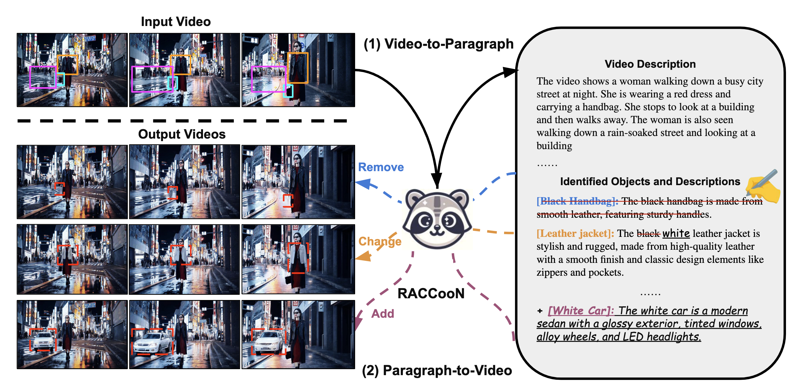

# RACCooN: A Versatile Instructional Video Editing Framework with Auto-Generated Narratives
[](https://raccoon-mllm-gen.github.io/)  [](https://arxiv.org/abs/2405.18406)   [](https://huggingface.co/jaehong31/RACCooN)


### Authors: [Jaehong Yoon*](https://jaehong31.github.io/), [Shoubin Yu*](https://yui010206.github.io/), [Mohit Bansal](https://www.cs.unc.edu/~mbansal/)
### University of North Carolina at Chapel Hill
<!-- * Paper: [arXiv](https://arxiv.org/abs/2405.18406)
* Project Page: [homepage](https://raccoon-mllm-gen.github.io/) -->
<!-- * Online Demo: Coming soon -->

<div align=center> 

</div>


# Setup

## Install Dependencies

1. (Optional) Creating conda environment

```bash
conda create -n RACCooN python=3.10.13
conda activate RACCooN
```

2. build from source

```bash
pip install -e .
```

<br>
<div align=center>

</div>

## Download Models

### Pre-trained Models

**Visual Encoder**: we adopt pre-trained [ViT-G](https://arxiv.org/abs/2303.15389) (1B), the codebase downloads the model automatically.

### V2P Fine-tuned Models

| Dataset | Types |
| :---    |    :----  | 
| VPLM| [Multi-object Description](https://huggingface.co/jaehong31/RACCooN/blob/main/mllm_finetuned/multi_obj_projector.bin) |
| VPLM| [Single-Object Description](https://huggingface.co/jaehong31/RACCooN/blob/main/mllm_finetuned/single_obj_projector.bin) |
| VPLM| [Layout-Prediction](https://huggingface.co/jaehong31/RACCooN/blob/main/mllm_finetuned/layout_pred_projector.bin) |

### P2V Fine-tuned Models

| Dataset | Types |
| :---    |    :----  | 
| VPLM| [Video Generation](https://huggingface.co/jaehong31/RACCooN/blob/main/unet_finetuned) |


# Dataset Preparation & Feature Extraction
We test our model on:

+ [VPLM](https://huggingface.co/jaehong31/RACCooN/tree/main/VPLM): we follow [ROVI data](https://huggingface.co/datasets/jianzongwu/rovi).


# Stage 1: Training and Inference (Video-to-Paragraph)
We provide RACCooN training and inference script examples as follows.

## 1) Training

```bash
cd v2p

sh scripts/v2p/finetune/vplm.sh
```

## 2) Inference

```bash
cd v2p

sh scripts/v2p/inference/vlpm.sh
```

# Stage 2: Training and Inference (Paragraph-to-Video)
We provide RACCooN training and inference script examples as follows. 
Our code is buit upon [MGIE](https://github.com/apple/ml-mgie). Please setup envoriment following MGIE instruction. 

## 1) Training

```bash
cd p2v

sh train.sh
```

## 2) Inference

we provide jupynote [scripts](https://github.com/jaehong31/RACCooN/blob/main/p2v/evaluate.ipynb) for P2V inference.


### TODO 
- [x] Release ckpts and VPLM dataset
- [ ] Video Feature Extraction Examples
- [x] V2P and P2V training
- [ ] Incorporate Grounding Modules


# Acknowledgments
The code is built upon [PG-Video-LLaVA](https://github.com/mbzuai-oryx/Video-LLaVA), [MGIE](https://github.com/apple/ml-mgie), [GroundingDino](https://github.com/IDEA-Research/Grounded-Segment-Anything), and [LGVI](https://github.com/jianzongwu/Language-Driven-Video-Inpainting).


# Reference
Please cite our paper if you use our models in your works:

```bibtex
@article{yoon2024raccoon,
  title={RACCooN: A Versatile Instructional Video Editing Framework with Auto-Generated Narratives},
  author={Yoon, Jaehong and Yu, Shoubin and Bansal, Mohit},
  journal={arXiv preprint arXiv:2405.18406},
  year={2024}
}
